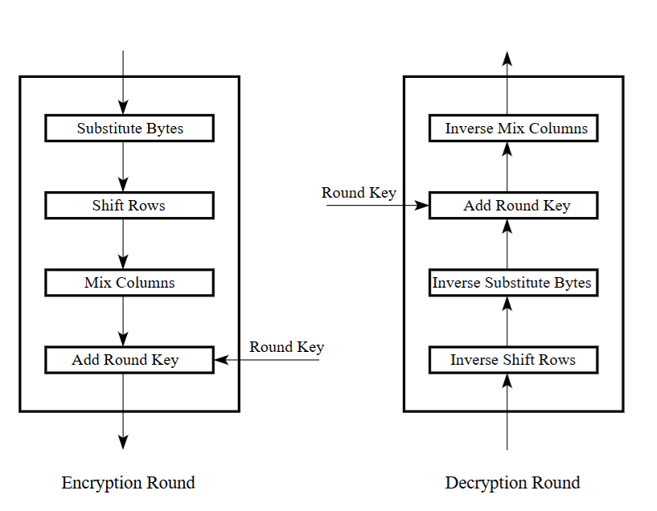
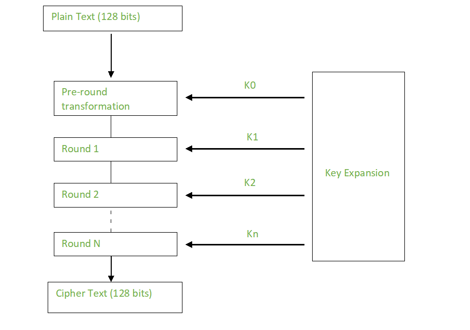
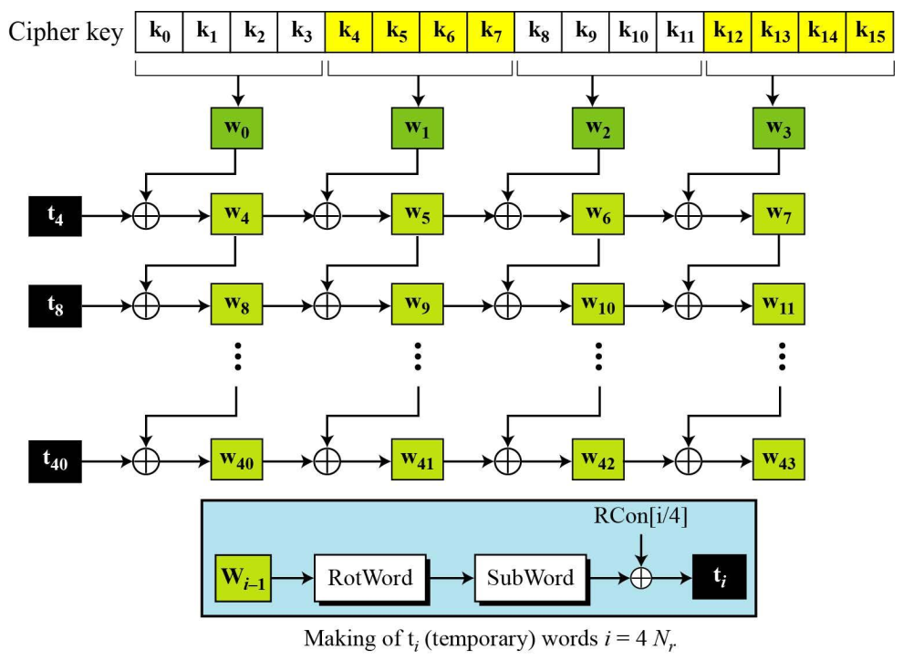
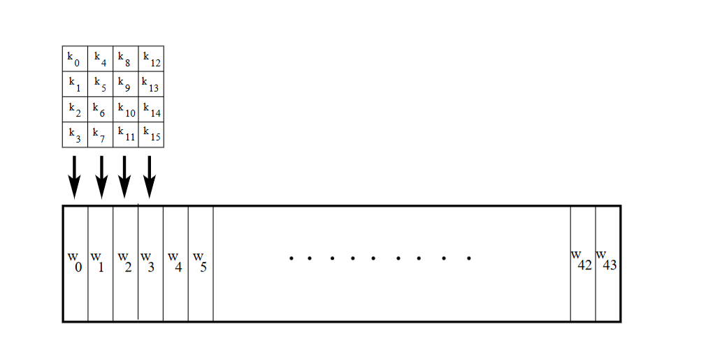

# AES

## Encryption

### AES Key Expansion

For use in AES, a single initial key can be expanded into a series of round keys using the AES key expansion technique. 

The AES key expansion method receives a four-word (16-byte) key and returns a linear array of 44 words (176 bytes). This is sufficient to provide both the initial AddRoundKey step and a four-word round key for each of the cipher's ten rounds.

| Round     | Words                                               |
|-----------|-----------------------------------------------------|
| Pre-round | w₀   w₁   w₂   w₃                                   |
| 1         | w₄   w₅   w₆   w₇                                   |
| 2         | w₈   w₉   w₁₀  w₁₁                                  |
| …         | …                                                   |
| Nᵣ        | w₄Nᵣ   w₄Nᵣ₊₁   w₄Nᵣ₊₂   w₄Nᵣ₊₃                     |

The key expansion consists of some sub function as follow:
- Step 1: The function performs the one-byte circular **left shift**
- Step 2: Using S-box each sub word performs a byte substitution
- Step 3: Finally result of Rot word and step 2 is XORed with the round constant called as **Rcon[Round]**

